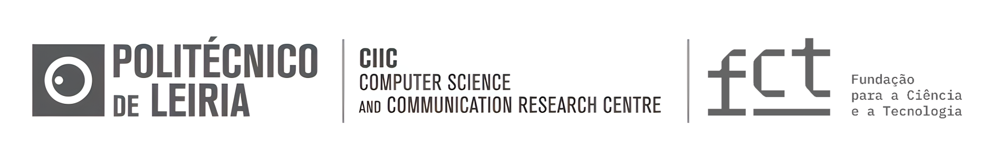

# InPainTor 🎨 (Work in Progress...)

---
<center>
    <a href="https://ciic.ipleiria.pt/">
        
    </a>
</center>

---

## Description

The **InPainTor** model has the capability to recognize objects and perform inpainting on specific objects in real-time.

This enables the model to selectively remove and fill in missing or unwanted objects in images, while preserving the
surrounding context.

## TODO:

    1. Train the model on the RORD dataset. (In progress...)
    2. Correct logging system.
    3. Test the model performance.

## Environment setup

### Conda environment

```bash
conda env create -f environment.yml
conda activate inpaintor
```

## Datasets

### **RORD**: A Real-world Object Removal Dataset

Source. https://github.com/Forty-lock/RORD

### **PAL4Inpaint**: Perceptual Artifacts Localization for Inpainting

**Rejected 🚫**: Lack of semantic information (object segmentation).

Source: https://github.com/owenzlz/PAL4Inpaint/tree/main

## Repo structure

```plaintext
InpaintTor/ 
├── assets/                   📂: Repo assets
│   └── img.png
├── checkpoints/              💾: Model checkpoints
│   ├── best_model.pth
│   └── ...
├── data/                     📂: Dataset files
│   └── CamVid
│   └── .gitkeep
├── logs/                     📃: Log files
├── notebooks/                📓: Jupyter notebooks
│   ├── 0_General_testing.ipynb                   📊: General testing
│   ├── 1_PA4Inpaint_dataset_analysis.ipynb       📊: Dataset analysis
│   ├── 1_RODR_dataset_analysis_processing.ipynb  📊: Dataset analysis
│   ├── 2_RORDDataset_class_test.ipynb            📊: Dataset testing
│   ├── 3_Create_data_splits.ipynb                📊: Data split creation
│   └── ...
├── outputs/                  📺: Output files generated during inference
├── src/                      📜: Source code files
│   ├── __init__.py           📊: Initialization file
│   ├── data_augmentation.py  📑: Data augmentation
│   ├── dataset.py            📊: Dataset implementation
│   ├── inference.py          📊: Inference script
│   ├── model.py              📑: Inpaintor model implementation
│   ├── layers.py             📊: Model layers
│   ├── logger.py             📊: Logger implementation
│   └── train.py              📊: Training script
├── .gitignore                🚫: Files to ignore in Git
├── environment.yml           🎛️: Conda environment configuration
├── main.py                   📜: Entry point for the Inpaintor model
└── README.md                 📖: Project README file

```

Acknowledgements
----------------

This work is funded by FCT - Fundação para a Ciência e a Tecnologia, I.P., through project with reference
2022.09235.PTDC.


License
-------

This project is licensed under [GPLv3](https://www.gnu.org/licenses/gpl-3.0.html).

