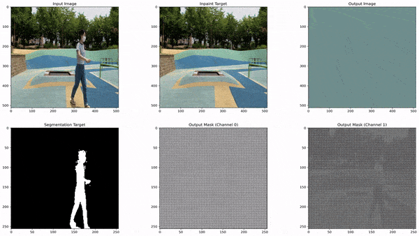
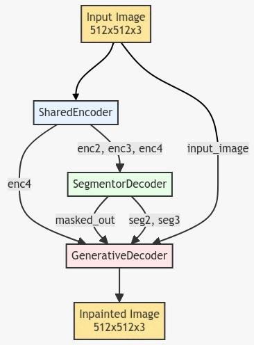
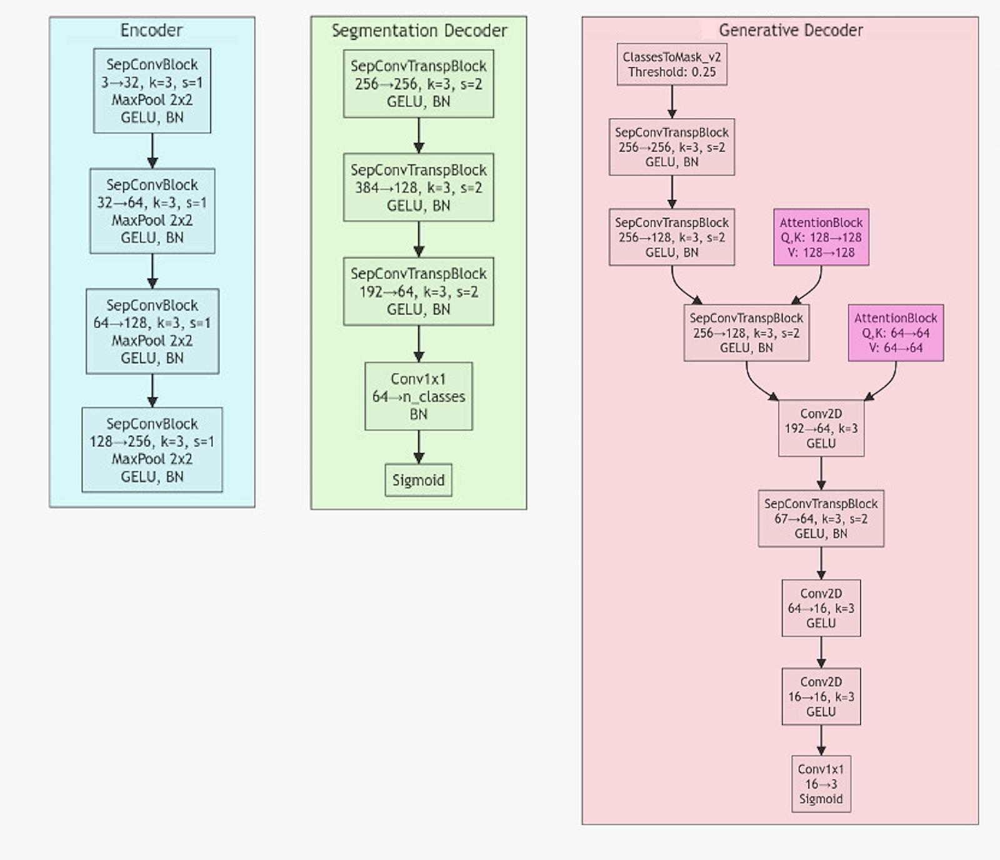
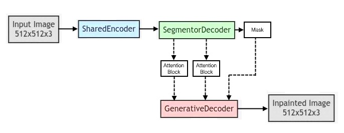
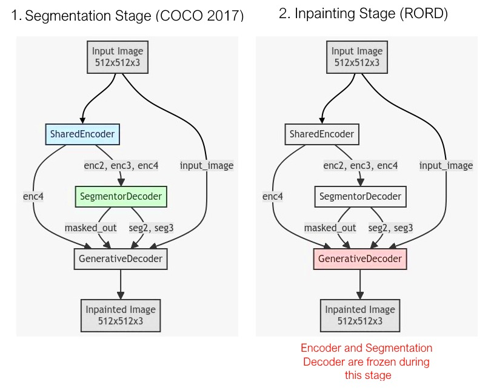
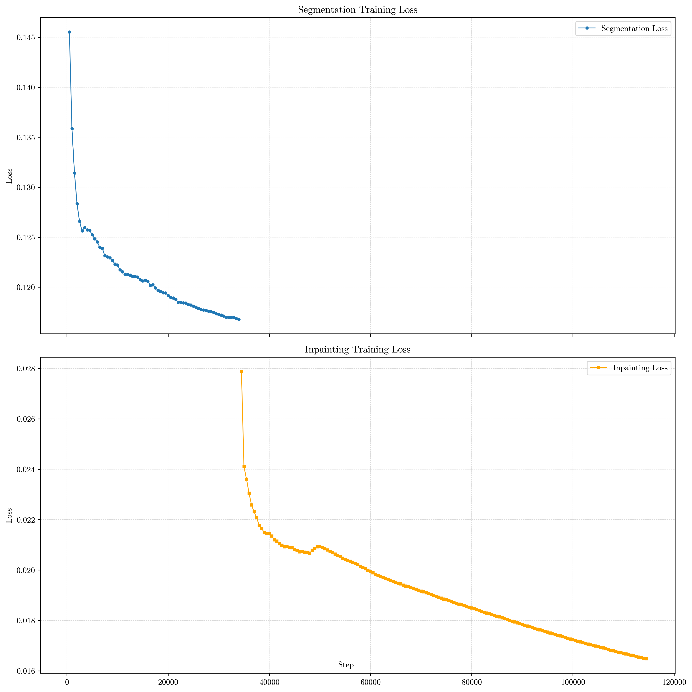

# InPainTor🎨: Context-Aware Segmentation and Inpainting in Real-Time

[](https://www.gnu.org/licenses/gpl-3.0)
[](https://www.python.org/downloads/release/python-380/)
[](https://docs.conda.io/en/latest/)

---
<p align="center">
  <a href="https://ciic.ipleiria.pt/">
    
  </a>
</p>

---

**InPainTor**🎨 is a deep learning model designed for context-aware segmentation and inpainting in real-time. It
recognizes objects of interest and performs inpainting on specific classes while preserving the surrounding context.

<center>
  
</center>

## 🚀 Features

- Real-time object recognition and inpainting
- Selective removal and filling of missing or unwanted objects
- Context preservation during inpainting
- Two-stage training process: segmentation and inpainting
- Support for COCO and RORD datasets

## 🚧 **WIP** (Work In Progress)

This project is currently under development. Use with caution and expect changes.

## 🛠️ Installation

1. Clone the repository:
   ```bash
   git clone https://github.com/your-username/InPainTor.git
   cd InPainTor
   ```

2. Create and activate the Conda environment:
   ```bash
   conda env create -f environment.yml
   conda activate inpaintor
   ```

## 🖥️ Usage

### Training

To train the InPainTor model:

```bash
python src/train.py --coco_data_dir <path_to_COCO> --rord_data_dir <path_to_RORD> --seg_epochs <num_epochs> --inpaint_epochs <num_epochs>
```

<details>
<summary>Click to view all training arguments</summary>

- `--coco_data_dir`: Path to the COCO 2017 dataset directory (default: '/media/tiagociiic/easystore/COCO_dataset')
- `--rord_data_dir`: Path to the RORD dataset directory (default: '/media/tiagociiic/easystore/RORD_dataset')
- `--seg_epochs`: Number of epochs for segmentation training (default: 10)
- `--inpaint_epochs`: Number of epochs for inpainting training (default: 10)
- `--batch_size`: Batch size for training (default: 2)
- `--learning_rate`: Learning rate for the optimizer (default: 0.1)
- `--image_size`: Size of the input images, assumed to be square (default: 512)
- `--mask_size`: Size of the masks, assumed to be square (default: 256)
- `--model_name`: Name of the model (default: 'InPainTor')
- `--log_interval`: Log interval for training (default: 1000)
- `--resume_checkpoint`: Path to the checkpoint to resume training from (default: None)
- `--selected_classes`: List of class IDs for inpainting (default: [1, 72, 73, 77])

</details>

### Inference

To perform inference using the trained InPainTor model:

```bash
python src/inference.py --model_path "path/to/model.pth" --data_dir "path/to/data" --image_size 512 --mask_size 256 --batch_size 1 --output_dir "path/to/outputs"
```

<details>
<summary>Click to view all inference arguments</summary>

- `--model_path`: Path to the trained model checkpoint
- `--data_dir`: Path to the directory containing images for inference
- `--image_size`: Size of the input images, assumed to be square (default: 512)
- `--mask_size`: Size of the masks, assumed to be square (default: 256)
- `--batch_size`: Batch size for inference (default: 1)
- `--output_dir`: Path to the directory to save the inpainted images

</details>

## 📁 Project Structure

<details>
<summary>Click to view the repository structure</summary>

```plaintext
InpainTor/ 
├── assets/                   📂: Repository assets (images, logos, etc.)
├── checkpoints/              💾: Model checkpoints
├── logs/                     📃: Log files
├── notebooks/                📓: Jupyter notebooks
├── outputs/                  📺: Output files generated during inference, training and debugging
├── src/                      📜: Source code files
│   ├── __init__.py           📊: Initialization file
│   ├── data_augmentation.py  📑: Data augmentation operations
│   ├── dataset.py            📊: Dataset loading and preprocessing
│   ├── debug_model.py        📊: Model debugging
│   ├── inference.py          📊: Inference script
│   ├── layers.py             📊: Model layers
│   ├── losses.py             📊: Loss functions
│   ├── model.py              📑: InpainTor model implementation
│   ├── train.py              📊: Training script
│   └── visualizations.py     📊: Visualization functions
├── .gitignore                🚫: Files to ignore in Git
├── environment.yml           🎛️: Conda environment configuration
├── README.md                 📖: Project README file
└── main.py                   📜: Entry point for the InpainTor model
```

</details>

## 🧠 Model Architecture

The InPainTor model consists of three main components:

1. **SharedEncoder**: Encodes input images into a series of feature maps.
2. **SegmentorDecoder**: Decodes encoded features into segmentation masks.
3. **GenerativeDecoder**: Uses segmentation information to generate inpainted images.

### Overview of InPainTor Model Architecture

<center>
  
</center>

### Model Components in Detail

<center>
  
</center>

### Model Concept

<center>
  
</center>

### Model Training Process

1. Train SharedEncoder and SegmentorDecoder for accurate segmentation
2. Freeze SharedEncoder and and SegmentorDecoder, train GenerativeDecoder.

<center>
  
</center>

### Example of Loss During Training Stages

<center>
  
</center>

## 📊 Dataset Requirements

<details>
<summary>RORD Inpainting Dataset Structure</summary>

The [RORD dataset](https://github.com/Forty-lock/RORD) should be organized as follows:

```
root_dir/
├── train/
│   ├── img/
│   │   ├── image1.jpg
│   │   ├── image2.jpg
│   │   └── ...
│   └── gt/
│       ├── image1.jpg
│       ├── image2.jpg
│       └── ...
└── val/
    ├── img/
    │   ├── image1.jpg
    │   ├── image2.jpg
    │   └── ...
    └── gt/
        ├── image1.jpg
        ├── image2.jpg
        └── ...
```

</details>

<details>
<summary>COCO Segmentation Dataset Structure</summary>

The [COCO dataset](https://cocodataset.org/#home) (2017 version with 91 classes) should be organized as follows:

```
root_dir/
├── train/
│   ├── img/
│   │   ├── image1.jpg
│   │   ├── image2.jpg
│   │   └── ...
│   └── gt/
│       ├── image1.jpg
│       ├── image2.jpg
│       └── ...
└── val/
    ├── img/
    │   ├── image1.jpg
    │   ├── image2.jpg
    │   └── ...
    └── gt/
        ├── image1.jpg
        ├── image2.jpg
        └── ...
```

For more information on COCO dataset classes, refer
to [this link](https://tech.amikelive.com/node-718/what-object-categories-labels-are-in-coco-dataset/).

</details>

## 🔮 Current Limitations and Future Work

<details>

<summary>Limitations</summary>

1. **Segmentation Performance**:
    - The current segmentation model works relatively well for small datasets with limited variety
    - It struggles with larger, more diverse datasets like COCO 2017.

2. **Generator Performance**:
    - The current generator architecture may be too simplistic, particularly in the layers following the masking
      process.
    - The frozen encoder in the generator could be limiting the model's learning capacity.

3. **Hardware Constraints**:
    - Memory limitations restrict model size and batch processing capabilities.
    - Impacts choice of architectures and training strategies.

4. **No Data Augmentation**:
    - Not currently integrated into the training pipeline (but the implementation is 90% ready)

</details>


<details>

<summary>Future Work</summary>

1. **Improve Segmentation Section**:
    - Investigate and implement more sophisticated segmentation architectures like **ENet** or **BiSeNet**
    - Check if itś possible to adapt pre-trained models to this architecture.

2. **Enhance Generator Architecture**:
    - Increase the number of parameters and layers after the masking process in the generator.
    - Experiment with more sophisticated generator designs, potentially allowing (limited) parts of the encoder to be
      trainable.

3. **Experiment with Cost Functions**:
    - Test and evaluate alternative loss functions.
    - Consider multi-objective loss functions that balance different aspects of the inpainting task.

4. **Incorporate Data Augmentation**:
    - Integrate the already implemented data augmentation techniques into the training pipeline.

5. **Evaluation Metrics**:
    - Implement evaluation metrics to better assess the quality of inpainted images.

</details>

## 🤝 Contributing

Contributions to the InPainTor project are welcome! Please follow these steps to contribute:

1. Fork the repository
2. Create a new branch for your feature or bug fix
3. Commit your changes
4. Push to your fork and submit a pull request

We appreciate your contributions to improve InPainTor!

## 🙏 Acknowledgements

This work is funded by FCT - Fundação para a Ciência e a Tecnologia, I.P., through project with reference
2022.09235.PTDC.

## 📄 License

This project is licensed under [GPLv3](https://www.gnu.org/licenses/gpl-3.0.html).

---

For more information or support, please open an issue in the GitHub repository.